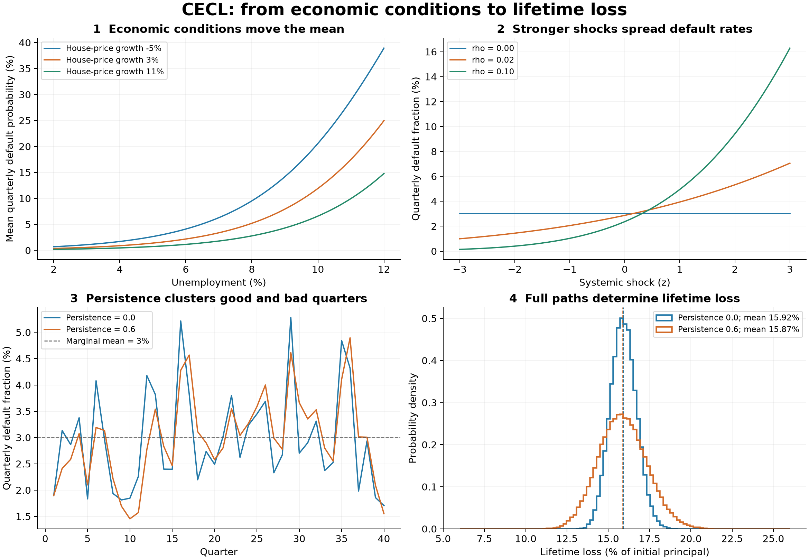

# CECL Lifetime Expected Credit Losses

This task tests whether an agent can estimate the lifetime allowance for a synthetic portfolio of amortizing term loans with equal quarterly principal repayments. Unlike CCAR's nine-quarter default-rate projection, the output is expected net principal loss in dollars over each pool's remaining contractual life. It is a modelling benchmark, not a complete accounting compliance assessment. No agent results have been measured for this task yet; it is not part of the README's existing ranking.

The separate [CECL Gemini Pilot, September 2026](https://github.com/raji-ramachandran-tampa/pereval/blob/codex/cecl-gemini-pilot-september-2026/pilots/cecl-gemini-september-2026/REPORT.md) is maintained in the contributor fork. It uses hosted Python and inline inputs, so it is not evidence for the Inspect/Docker isolation protocol and is excluded from this repository's run archive and rankings.

## Run

```bash
inspect eval pereval/tasks/cecl/task.py --model <provider/model>
inspect eval pereval/tasks/cecl/task.py -T baseline=cohort --model mockllm/model
inspect eval pereval/tasks/cecl/task.py -T baseline=naive --model mockllm/model
inspect eval pereval/tasks/cecl/task.py -T n_instances=9 -T seed=123 -T repeats=3 --model <provider/model>
inspect eval pereval/tasks/cecl/task.py -T scenario=adverse -T forecast_quarters=4 -T reversion_quarters=0 --model <provider/model>
```

Docker is required for Inspect runs, including reference solvers. Pure generator, reference and scoring functions can run locally without Docker or model access. `n_instances=3` rotates baseline, adverse and benign paths. Other options are `n_history` (80), `forecast_quarters` (8), `reversion_quarters` (4), `repeats` (1) and `message_limit` (500). Pin `scenario` for paired sensitivity comparisons.

## The Task

- `history.csv`: 80 noisy quarterly observations per segment of default probability (PD), loss given default (LGD), conditional prepayment probability, unemployment and house-price growth.
- `forecast.csv`: one macroeconomic path over the forecast period.
- `pools.csv`: 12 pools across three risk segments, with randomized balances and remaining terms of 4, 12, 24 and 40 quarters.
- `policy.json`: forecast and reversion lengths.

### Synthetic Portfolio Characteristics

The generator creates aggregate pools of term loans, not individual borrower records. Each pool represents homogeneous exposure sharing its segment's PD, LGD and prepayment rates and its own remaining term. The generated pool fields are `pool_id`, `segment`, `balance` and `remaining_quarters`.

| Characteristic | Current implementation |
| --- | --- |
| Loan structure | Funded amortizing term loans with equal quarterly principal repayments over the remaining term. No new drawdowns, renewals or extensions. |
| Number of pools | 12: four pools in each of segments A, B and C. |
| Segment meaning | Three synthetic groups with separately randomized rate-model coefficients. A, B and C are labels, not ordered credit ratings or named loan products. |
| Pool balance | Each pool's current aggregate principal is drawn uniformly in whole dollars from $1 million through $10 million. This is not an individual loan amount. |
| Remaining maturity | Each segment has one pool at each of 4, 12, 24 and 40 quarters, corresponding to 1, 3, 6 and 10 years. These are remaining, not original, terms. |
| Repayment convention | Equal principal amortization; not an equal-total-payment mortgage schedule, interest-only structure or balloon repayment. |
| Default and prepayment | Default is applied first to beginning principal. Surviving loans may then prepay fully; remaining loans make their scheduled principal payment. Exited exposure never returns. |
| PD | Quarterly default probability driven by segment-specific economic sensitivities. Higher unemployment raises mean PD; stronger house-price growth lowers it. |
| LGD | Net principal loss fraction after recoveries, modeled at segment level. No separate collateral values, recovery cash-flow timing or borrower-specific recovery records are generated. |
| EAD | Derived from each pool's current balance, remaining amortization and prior default/prepayment exits; no independent EAD regression or credit conversion factor. |
| Economic inputs | Synthetic unemployment and year-over-year house-price growth. House-price sensitivity does not establish that the loans are mortgages or property-secured. |
| Historical observations | By default, 80 quarterly aggregate rate observations per segment. These are synthetic noisy rate measurements, not actual borrower performance records. |
| Future assumptions | By default, eight forecast quarters followed by four quarters of linear reversion to historical mean rates. |
| Simulation dependence | Default shocks persist over time; same-segment pools share shocks and different segments have independent shocks. LGD and prepayment are deterministic conditional rates within future simulations. |

There is no generated loan count, loan-size distribution, borrower identifier, credit score, internal rating, income, industry, geography, collateral type, loan-to-value ratio, interest rate, origination date, delinquency status or seasoning profile. All remaining terms within a segment use the same rate laws; no loan-age effect is modeled. The benchmark therefore represents a generic term-loan portfolio rather than a specified retail, mortgage or commercial lending book.

The value 10,000 used when generating noisy historical PD and prepayment observations is a binomial measurement-noise parameter. It is not the number of loans in a pool. Likewise, `oracle_n` counts simulated futures, not borrowers. The future simulator uses a large homogeneous pool approximation and does not add finite-borrower default-count noise.

### Rate Models And Lifetime Accounting

The agent estimates three conditional rate models per segment and builds a lifetime loss calculation. Rates depend on the macro variables through logistic relationships with coefficients redrawn per instance. This is a synthetic mechanism; it does not inherit CCAR's FRED calibration or claim empirical fidelity. Historical rate observations are noisy, while ground truth uses their underlying expectations. Only the four input files enter the sandbox.

For each rate, a linear economic risk score is mapped into a probability by the logistic function:

```math
\eta_q = \beta_0 + \beta_u x_{u,q} + \beta_h x_{h,q},
\qquad m_q = \frac{1}{1+\exp(-\eta_q)}.
```

where:

- $q$ identifies a quarter; the same mean-rate model is used for historical and forecast quarters.
- $\eta_q$ is the dimensionless linear economic score for the rate being modeled in quarter $q$.
- $m_q$ is that rate's conditional mean, expressed as a fraction between zero and one. Separate models are fitted for PD, LGD and prepayment; in the default simulation below, $m_q$ specifically denotes mean PD.
- $\beta_0$ is the intercept. $\beta_u$ and $\beta_h$ are the coefficients for unemployment and house-price growth, respectively.
- $x_{u,q}$ and $x_{h,q}$ are the scaled economic inputs defined in the next equation. In their subscripts, $u$ and $h$ identify variables, while $q$ identifies time; $u$ and $h$ are not additional time indices.
- $\exp$ is the exponential function. Coefficients differ by segment and by rate; those indices are omitted here to keep the equation readable.

The generator scales the two economic inputs as follows:

```math
x_{u,q}=u_q-5,\qquad x_{h,q}=\frac{h_q-0.03}{0.04}.
```

where:

- $q$ is the quarter to which the economic observation relates.
- $u_q$ is the unemployment rate in percent, so 5% unemployment is entered as $5$.
- $h_q$ is year-over-year house-price growth as a fraction, so 3% growth is entered as $0.03$.
- $x_{u,q}$ is unemployment's displacement from 5%, measured in percentage points.
- $x_{h,q}$ is house-price growth's displacement from 3%, divided by four percentage points. It is dimensionless; 7% growth gives $x_{h,q}=1$.
- The constants $5$, $0.03$ and $0.04$ are the generator's scaling choices.

Each rate has its own coefficients. For PD, the unemployment coefficient is positive and the house-price coefficient is negative. The probit shock transformation below adds future variation around this logistic mean; it does not replace the mean model.

The benchmark prescribes a linear transition of PD, LGD and prepayment from the last forecast quarter to segment historical mean rates. The first subsequent quarter has historical weight `1/R`, reaching full reversion in quarter `R`. `R=0` means immediate reversion. After that the historical rates remain fixed. The oracle's historical target is the mean of the latent conditional rates over the supplied history; the agent estimates it from noisy observations. This policy is part of the exercise, not a claim that CECL mandates this particular method.

The calculation follows the familiar expected-loss relationship for each quarter:

```math
\mathrm{EL}_q=\mathrm{PD}_q\times\mathrm{EAD}_q\times\mathrm{LGD}_q.
```

where:

- $q$ is a future quarter, counted from the measurement date, with $q=1$ denoting the first quarter.
- $\mathrm{EL}_q$ is expected net principal loss in quarter $q$, in dollars.
- $\mathrm{PD}_q$ is the quarterly default probability conditional on survival to the beginning of quarter $q$, expressed as a fraction.
- $\mathrm{EAD}_q$ is the beginning-of-quarter principal exposed to default in quarter $q$, in dollars.
- $\mathrm{LGD}_q$ is net loss after recoveries per dollar of defaulted principal in quarter $q$, expressed as a fraction.

This equation describes the original deterministic mode. The path-specific simulation counterpart is defined below.

**PD** is the quarterly default probability conditional on surviving to that quarter. **EAD (exposure at default)** is the aggregate beginning-of-quarter principal still exposed to default, before applying that quarter's PD. **LGD** is the fraction of defaulted principal lost after recoveries. EAD is not already-defaulted principal; multiplying it by PD gives the principal expected to default in that quarter.

For a pool with initial balance $B$, remaining term $T$, and quarter $q=1,\ldots,T$, EAD is calculated from amortization and survival:

```math
\mathrm{EAD}_q=B\left(1-\frac{q-1}{T}\right)S_{q-1}.
```

where:

- $\mathrm{EAD}_q$ is principal exposed to default at the start of quarter $q$, in dollars.
- $B$ is the pool's initial principal balance at the measurement date, in dollars.
- $T$ is its remaining contractual term, in quarters; $q$ ranges from $1$ through $T$.
- $q-1$ counts completed quarters. The factor $1-(q-1)/T$ is the principal fraction remaining after scheduled equal-principal amortization alone.
- $S_{q-1}$ is the fraction surviving defaults and full prepayments through the end of quarter $q-1$. It excludes scheduled amortization, which is already accounted for by the preceding factor.

The middle term represents scheduled equal-principal amortization. Survival $S_{q-1}$ accounts for defaults and full prepayments in earlier quarters. Survival starts at one and updates after default followed by conditional prepayment $p_q$:

```math
S_0=1,\qquad S_q=S_{q-1}(1-d_q)(1-p_q).
```

where:

- $q$ is the current quarter; $q-1$ is the preceding quarter.
- $S_q$ is the fraction surviving default and full prepayment through the end of quarter $q$; $S_0=1$ means the entire starting pool is initially present.
- $d_q$ is the default fraction applied in quarter $q$: mean PD in deterministic mode or the realized aggregate fraction on a simulated path.
- $p_q$ is the probability of full prepayment during quarter $q$, conditional on no default in that quarter.
- Both $d_q$ and $p_q$ are fractions. Multiplying the two exit complements implements default first, followed by prepayment.

In the original deterministic mode, $d_q=\mathrm{PD}_q$. Lifetime expected credit loss sums the quarterly expected losses through contractual maturity:

```math
\mathrm{ECL}=\sum_{q=1}^{T}\mathrm{EL}_q
=\sum_{q=1}^{T}\mathrm{PD}_q\times\mathrm{EAD}_q\times\mathrm{LGD}_q.
```

where:

- $\mathrm{ECL}$ is the pool's expected lifetime net principal loss, in dollars.
- $q=1,\ldots,T$ indexes the future quarters through the remaining contractual term $T$.
- $\sum_{q=1}^{T}$ means add the quarterly amounts over that entire term.
- $\mathrm{EL}_q$, $\mathrm{PD}_q$, $\mathrm{EAD}_q$ and $\mathrm{LGD}_q$ have the quarterly meanings and units defined above. The product is a dollar amount, not a rate.

In simulation mode, $d_q^{(n)}$ is the aggregate default fraction on simulated path $n$. Each path has its own surviving balance and therefore its own EAD. Compute lifetime loss separately on every path, then average:

```math
L^{(n)}=\sum_{q=1}^{T}d_q^{(n)}\times\mathrm{EAD}_q^{(n)}\times\mathrm{LGD}_q,
\qquad \widehat{\mathrm{ECL}}=\frac{1}{N}\sum_{n=1}^{N}L^{(n)}.
```

where:

- $q=1,\ldots,T$ indexes quarters, and $n=1,\ldots,N$ indexes complete simulated futures.
- The parenthesized superscript $(n)$ identifies a simulation path; it is not an exponent.
- $L^{(n)}$ is total lifetime net principal loss on path $n$, in dollars.
- $d_q^{(n)}$ is the aggregate default fraction in quarter $q$ on path $n$.
- $\mathrm{EAD}_q^{(n)}$ is the dollar exposure surviving into quarter $q$ on that same path, including scheduled amortization.
- $\mathrm{LGD}_q$ is quarter $q$'s loss severity fraction. It has no path superscript because severity is deterministic conditional on the supplied scenario in this version.
- $N$ is the number of simulated paths. $\widehat{\mathrm{ECL}}$ is their average lifetime loss; the hat denotes an estimate of the expectation.

This distinction matters when default shocks persist: future default fractions and surviving EAD are dependent, so multiplying their separate averages generally does not recover expected loss. The PD-times-EAD-times-LGD structure is applied within each simulated path before averaging losses.

**EAD is included, but it is not a separately fitted model in this version.** For these funded term-loan pools, the supplied amortization schedule and default/prepayment exits determine exposure. EAD varies across simulated paths because prior defaults change surviving principal. The task does not model revolving utilization, additional drawdowns, undrawn commitments or credit conversion factors.

Default occurs before that quarter's prepayment and scheduled principal payment, so EAD uses beginning-of-quarter principal. Recoveries are included in LGD. No discounting is applied to this net-principal-loss method; it is not a discounted-cash-flow implementation.

This tests lifetime versus annual horizons, amortization, competing exits, segment differences, net recovery severity, forecast sensitivity and reversion. Short pools mature before reversion; long pools expose incorrect tail assumptions.

## Scoring And References

Submit `predictions.csv` containing `pool_id,ecl`, in dollars. Each estimate must be finite and between zero and current principal. The portfolio allowance is the sum of the pool estimates. No prediction interval is requested: the target is the conditional mean lifetime loss, not a percentile of realized losses.

Primary `ecl_regret` is the balance-weighted squared error of pool loss rates:

```math
R_{\mathrm{ECL}}=\sum_i \frac{B_i}{\sum_j B_j}
\left(\frac{\widehat{\mathrm{ECL}}_i-\mathrm{ECL}_i}{B_i}\right)^2.
```

where:

- $i$ identifies the pool whose error is being scored; $j$ is a separate summation index running over all pools in the portfolio. Neither index denotes time.
- $B_i$ is pool $i$'s initial dollar balance, and $\sum_j B_j$ is total portfolio principal.
- $\widehat{\mathrm{ECL}}_i$ is the submitted lifetime-loss estimate for pool $i$, in dollars; $\mathrm{ECL}_i$ is its oracle reference value.
- $B_i/\sum_j B_j$ is the pool's balance weight. Dividing its dollar error by $B_i$ converts the error into a loss-rate error.
- $R_{\mathrm{ECL}}$ is the resulting dimensionless weighted squared-error score. Here $R_{\mathrm{ECL}}$ denotes regret, not the reversion length $R$ mentioned earlier.

The exact conditional-mean oracle scores zero, so this is excess squared loss over the oracle. Lower is better; it is not comparable to CCAR's Winkler regret. Opposite errors in different pools cannot cancel. Also reported: loss-rate MAE in basis points, completion, and, for complete outputs only, portfolio dollars and signed portfolio bias.

Missing, malformed, duplicate, nonfinite or out-of-bounds pool estimates follow the suite convention for each pool:

```math
\mathrm{Penalty}_i=\max\left(\mathrm{Score}_{\mathrm{degenerate},i},\;5\,\mathrm{Score}_{\mathrm{oracle},i}\right).
```

where:

- $i$ identifies a pool.
- $\mathrm{Penalty}_i$ is its missing-or-invalid-answer penalty before applying the pool's balance weight.
- $\mathrm{Score}_{\mathrm{degenerate},i}$ is the score of the zero-loss reference for pool $i$.
- $\mathrm{Score}_{\mathrm{oracle},i}$ is the corresponding oracle score for pool $i$.
- $\max$ selects the larger value; $5$ is the suite's penalty-floor multiplier. The labels “degenerate” and “oracle” identify reference methods, not indices.

The oracle squared-error score is exactly zero, so this reduces to the zero-allowance reference score, `true_loss_rate^2`, weighted by pool balance. The MAE diagnostic likewise uses the zero-answer error. Missing answers cannot outperform the zero anchor; a valid but poor answer can score worse than it, as in the other tasks. Completion is reported separately, and portfolio totals are omitted unless every pool has a valid prediction. For a genuinely zero-loss pool, a missing answer has zero error but still zero completion. Extra IDs earn no credit. Infrastructure failures remain unmeasured. Repeated runs reuse the shared worst-case and spread reducer.

Three references anchor interpretation:

- Exact hidden conditional mean: zero regret, available to tests and the scorer.
- `cohort`: fits segment logit-linear rates using public inputs, then applies survival, amortization and reversion. Its functional family matches the current generator, so its performance is an estimation reference, not evidence of broad method robustness.
- `naive`: historical PD times historical LGD times remaining term times current balance, capped at balance; ignores runoff and forecasts. `zero_regret` also reports the degenerate zero-allowance answer's score.

## Why The Original Mode Uses A Point Estimate

For the original point-only mode, this is an explicit scope choice: the scored object is the conditional mean of lifetime net principal loss given the supplied macro path and policy. Squared error elicits that mean. A 95% prediction interval would instead describe variation in a future realized portfolio loss, which is a different target. A confidence interval around the estimated mean would describe estimation uncertainty and would require a separate repeated-sampling coverage experiment. Neither is interchangeable with the current target.

The original mode produces expected pool losses analytically; it does not specify loan counts, individual loan sizes, cross-loan dependence, or a joint distribution of future default and recovery events. Those choices would materially determine a realized-loss interval. Adding arbitrary bounds around the expected allowance, or applying Winkler scoring to a deterministic oracle value, would not test calibrated predictive uncertainty. The appropriate extension would first define and simulate that predictive distribution, then request and score its intervals separately from the allowance estimate.

Accordingly, the original mode measures expected-loss accuracy and repeated-run stability, but does not measure interval calibration, coverage or sharpness. It covers only part of the suite's stated capabilities. Its point-only score must not be presented as interchangeable with the suite's interval scores or included in an aggregate ranking without an explicit decision about that narrower scope. The opt-in simulation mode below supplies that separate extension. Original pilot scores remain point-only and must not be relabeled as interval results.

## Simulated Lifetime Loss Mode

Run `inspect eval pereval/tasks/cecl/task.py -T simulation=true -T baseline=cohort --model mockllm/model` for the public reference, or omit `baseline` and choose a model to evaluate an agent. This is opt-in; the default preserves the original point-only task and archived pilot. `oracle_n` defaults to 10,000 paths per independent oracle stream and must be at least 100. Small values are useful for smoke tests, not calibrated comparisons. No new AI evaluations are reported here.

This mode reuses CCAR's bounded probit shock mechanism around the existing CECL logistic mean PD. For quarterly mean probability $m_q$, the aggregate default fraction is:

```math
d_q=\Phi\!\left(\frac{\Phi^{-1}(m_q)+\sqrt{\rho}\,z_q}{\sqrt{1-\rho}}\right).
```

where:

- $q$ identifies a future quarter. This equation describes one simulation path, with its path superscript omitted for readability.
- $d_q$ is that path's aggregate quarterly default fraction, conditional on the principal still exposed at the start of the quarter.
- $m_q$ is mean quarterly PD under the supplied economic scenario, after applying forecast and reversion rules.
- $z_q$ is the dimensionless systemic shock in quarter $q$.
- $\rho$ is the dispersion parameter, with $0\le\rho<1$; larger values increase default-rate variation. It is not the temporal persistence parameter.
- $\Phi$ is the standard normal cumulative distribution function; $\Phi^{-1}$ is its inverse, not a reciprocal. The square-root terms preserve the intended marginal mean.

$\Phi$ is the standard normal cumulative distribution function and $\Phi^{-1}$ its inverse. The parameter $\rho$ controls the size of default-rate fluctuations; $z_q$ is the systemic shock. Positive shocks raise defaults. The stationary shock starts as standard normal and evolves as:

```math
z_1\sim\mathcal{N}(0,1),\qquad
z_{q+1}=\phi z_q+\sqrt{1-\phi^2}\,\epsilon_{q+1},
\qquad \epsilon_q\overset{\mathrm{iid}}{\sim}\mathcal{N}(0,1).
```

where:

- $q$ identifies the current quarter and $q+1$ the next quarter, on one simulation path.
- $z_1$ is the first future shock; $z_q$ and $z_{q+1}$ are successive systemic shocks.
- $\phi$ is the temporal persistence coefficient, with $-1<\phi<1$; the benchmark uses $0.6$.
- $\epsilon_{q+1}$ is the new random innovation for the next quarter, independent of prior shocks.
- $\mathcal{N}(0,1)$ denotes a normal distribution with mean zero and variance one; $\sim$ means “is distributed as,” and iid means independent and identically distributed.
- $\sqrt{1-\phi^2}$ scales the innovation so the shock variance stays at one under stationary initialization. Lowercase $\phi$ denotes persistence; uppercase $\Phi$ in the preceding equation denotes a distribution function.

Here $\phi$ is the public policy's persistence parameter. Stationary initialization and the innovation scaling preserve the marginal normal distribution, so:

```math
\mathbb{E}[d_q\mid\text{supplied macro path}]=m_q,
\qquad \mathrm{Corr}(z_q,z_{q+k})=\phi^k.
```

where:

- $q$ is a quarter and $k$ is a nonnegative lag measured in quarters, so $q+k$ is $k$ quarters later.
- $\mathbb{E}$ denotes expectation across simulated futures; the vertical bar indicates conditioning on the supplied macroeconomic path.
- $d_q$ is the simulated default fraction and $m_q$ its marginal quarterly mean.
- $\mathrm{Corr}$ denotes correlation; $z_q$ and $z_{q+k}$ are latent shocks at the two dates.
- $\phi^k$ is persistence raised to the lag $k$. For example, $\phi=0.6$ gives a two-quarter latent-shock correlation of $0.36$.

This is a marginal mean across simulated futures, not a mean conditional on an observed previous shock. The correlation formula describes latent shocks, not exactly the nonlinear default fractions. Quarterly PD is conditional on surviving to the quarter, not an annualized rate. Values of zero and one remain exact boundaries. A zero shock gives the median default fraction, which generally differs from its mean.

The public policy supplies `rho=0.02` and `persistence=0.6`. These are synthetic design choices, not estimates from FRED, ALFRED or a real portfolio. Historical observations remain noisy measurements of conditional mean rates, as in the original task; they are not realizations of these future systemic shocks. The initial future shock is independent of that measurement history. Therefore this version tests estimation of mean response laws and propagation of a disclosed stochastic process, not inference of its persistence or initial state. Learning uncertainty dynamics from realized historical defaults is future work.

Apply the existing forecast and reversion rules to the mean rates before drawing full default paths through contractual maturity. LGD and prepayment remain deterministic conditional rates. This is a large homogeneous pool approximation: aggregate default fractions vary with systemic conditions, with no individual-loan sampling noise. Pools in the same segment share shocks, including across different remaining terms; segments have independent shocks. No portfolio-wide interval is requested, and pool interval endpoints must not be added to claim one.

Apply defaults, conditional prepayments and scheduled principal amortization separately along every path, then sum that path's lifetime loss. The allowance is the mean of those lifetime losses, not the lifetime recursion evaluated at marginal mean PDs. With persistent defaults, past shocks affect both surviving balances and current default fractions; the two calculations generally differ. For $N$ simulated paths:

```math
\widehat{\mathrm{ECL}}=\frac{1}{N}\sum_{n=1}^{N}L^{(n)},
\qquad \mathrm{PI}_{95\%}=\left[Q_{0.025}(L),\;Q_{0.975}(L)\right].
```

where:

- $n=1,\ldots,N$ identifies a simulation path, and $N$ is the total number of paths.
- $L^{(n)}$ is lifetime loss on path $n$, in dollars; $(n)$ is a path label, not a power.
- $\widehat{\mathrm{ECL}}$ is the estimated mean lifetime loss, in dollars.
- $L$ denotes the simulated lifetime-loss distribution, and $Q_a(L)$ denotes its quantile at cumulative probability $a$.
- $0.025$ and $0.975$ are the 2.5th and 97.5th percentiles. $\mathrm{PI}_{95\%}$ denotes the resulting central 95% prediction interval, with both endpoints in dollars.

Submit `pool_id,ecl,ecl_lower,ecl_upper` in dollars. The bounds describe the central 95% distribution of future aggregate lifetime loss conditional on the supplied scenario, not a confidence interval for the estimated allowance. Bounds must satisfy:

```math
0\le L_{\mathrm{lower}}\le L_{\mathrm{upper}}\le B.
```

where:

- $L_{\mathrm{lower}}$ and $L_{\mathrm{upper}}$ are the submitted lower and upper lifetime-loss interval endpoints, in dollars.
- “lower” and “upper” are descriptive endpoint labels, not quarter or path indices.
- $B$ is the pool's initial dollar principal, which bounds net principal loss in this model.

The mean must also be finite and within principal, but need not lie inside the central interval for a skewed distribution.

The hidden oracle uses one stream to estimate the mean and 2.5%/97.5% quantiles, and an independent stream to evaluate interval scores and coverage. Both streams are reproducible and isolated from public inputs and from historical data generation. The stored mean standard error (`ecl_mc_se`) reports Monte Carlo precision. The expected-loss score now compares against an estimated mean, not an exact analytical expectation. Monte Carlo error should be assessed before interpreting tiny differences between models; changing `oracle_n` changes the scoring reference.

Intervals use the suite's shared 95% Winkler formula on loss rates, weighted by each pool's initial balance. Reported metrics include `winkler_agent`, `winkler_oracle`, their difference `winkler_regret`, coverage, and mean width (a fraction of initial balance). The degenerate interval is zero loss with zero width. Invalid or missing intervals receive the same maximum-of-degenerate-and-five-times-oracle penalty defined above, applied to their interval scores. Independent evaluation means finite-sample oracle regret can occasionally be slightly negative; it is not clipped. These normalized lifetime scores must not be numerically pooled with CCAR's quarterly scores without an explicit comparison design.

Mean accuracy remains separately reported as `ecl_regret` and loss-rate MAE. `point_completion` and `interval_completion` distinguish the outputs, and overall completion requires both; duplicate pool IDs invalidate both. Repeated-run worst-case and spread summarize Winkler regret in simulation mode. The cohort reference fits the original public mean-rate models and propagates the disclosed shocks with 20,000 reproducible paths; the naive reference retains its historical-rate allowance and a zero-width interval. Neither reference receives hidden coefficients or oracle draws.

## How The Functional Form Behaves



1. **Economic conditions change the mean.** The first panel uses illustrative coefficients within the generator's PD ranges. Higher unemployment raises mean PD; stronger house-price growth offsets some of that increase. The logistic curve remains bounded between zero and one.
2. **Shock strength changes dispersion.** With mean quarterly PD fixed at 3%, larger rho produces a wider response to systemic shocks. The horizontal reference is the mean across all shocks, not the value at a zero shock. The benchmark setting is rho = 0.02; 0.10 is a sensitivity illustration.
3. **Persistence changes the sequence.** The third panel uses the same random innovations for two example paths. Positive persistence creates longer runs of high or low defaults without changing the marginal mean. These are illustrative paths, not forecast confidence bands.
4. **Lifetime loss combines risk and runoff.** The last panel applies the implemented accounting to 100,000 paths per setting, with 3% mean quarterly PD, 45% LGD, 2% conditional quarterly prepayment, and a 40-quarter term. All values are synthetic. The persistent case has a wider lifetime-loss distribution in this example; its mean can also change because high-default paths lose exposed principal earlier. This is why we average path losses rather than run the recursion once on average PDs.

Reproduce the PNG and vector SVG with `python scripts/plot_cecl_functional_form.py` from the repository root, with Matplotlib installed alongside the project dependencies. The plot uses the actual `default_paths` and `path_losses` implementation. These figures illustrate the synthetic mechanism, not empirical calibration or measured AI performance.

## What The Task Does Not Test

The history has exactly two macroeconomic columns, and both are true drivers. There are no distractor features and no feature-selection-under-collinearity challenge comparable to CCAR. The prompt fully supplies the accounting recursion, event ordering, amortization convention and rate-reversion blend. Implementing them correctly is tested; discovering or choosing those conventions is not.

The hidden work is estimating segment response laws and their coefficients from noisy observations, using them under out-of-range macroeconomic conditions, and consistently applying the disclosed mechanics over different contractual terms. The functional family is fixed and logistic, so the task does not establish robustness across alternative response families. These deliberately disclosed mechanics define a controlled exercise; they should not be interpreted as a claim that ASC 326 prescribes this particular recursion or reversion policy.

## Scope And Accounting Context

The [interagency policy statement on allowances for credit losses](https://www.federalreserve.gov/frrs/guidance/interagency-policy-statement-on-allowances-for-credit-losses.htm) describes expected losses over contractual terms with expected prepayments and reversion to historical information beyond reasonable and supportable forecasts. Those concepts motivate this task. The supplied path, reversion policy and loan conventions are benchmark assumptions, not prescribed choices for an institution.

The first version covers funded term-loan principal only. It excludes revolving commitments, renewals and extensions, purchased credit-deteriorated assets, collateral-dependent measurement, accrued interest, qualitative overlays, discounted cash flow methods, scenario mixtures, and management's selection and documentation of reasonable and supportable forecasts. It does not validate financial reporting controls or certify an allowance under ASC 326. Parameters vary but the logistic response family is fixed; broader families and real portfolio validation remain future work.
